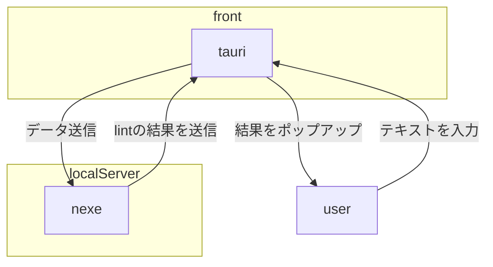

# textlint-tauri

tauriによって実装された、文書較正用のプログラム。  
デスクトップアプリをtauriで構成し、lint用のサーバーをnexeによってコンパイルしたNode.jsサーバーをローカルで起動し、処理させています。  

textlintで自然言語をlintすることは既にいくつかの先例が存在します。  
しかし、VSCodeを利用する必要があり、通常のテキストエディタチックに使いたい場合は使用感が良いとは言えません。
また、データをよくわからないサーバーに送信しているサービスもあり、セキュリティリスクがあるものも存在します。  

それらのリスクを低減し、もっと気軽にlintを利用したいというモチベーションで開発を進めています。

## 構成

